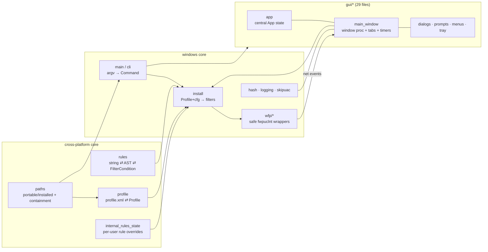

# amwall — Logic Atlas

> **Purpose.** One place to see the whole program's logic at once, so a reader (human or
> Claude) reasons about cross-cutting behavior instead of re-reading files piecemeal and
> guessing. Built from a full read of the Windows crate. Granularity is **subsystem → key
> functions (one line each) → invariants → state → coupling** — not a line-by-line mirror.
>
> **How to use.** Start at the L0 map for the shape. Drop into a subsystem's section for its
> function inventory + the invariants that must hold. The **cross-cutting flows** section is
> where the dangerous bugs live (they're relationships between subsystems, not single
> functions — e.g. the v1.1.17/18 install-order bug).
>
> **Maintenance.** Regenerate a section when you materially change that subsystem. Line
> numbers drift — trust the function *names* and *invariants*, verify positions against code.
> Companion: the visual verification map (which stages are guarded vs. blind) and
> `feedback_verify_by_running`. Snapshot: amwall @ v2.0.1 (released on main).
>
> **Scope.** This atlas maps the *enforcement spine* (profile/config → WFP filters → drop →
> prompt). The v2.0.0 network meter (`connections` traffic + `net_meter` ETW) is **observation**,
> not enforcement — it drives the Apps/Connections speed + interface columns and never touches WFP,
> so it adds no stage to the enforcement pipeline. See the `net_meter` entry under
> "System integration / enumeration".

---

## L0 — the whole program at a glance

amwall is a WFP firewall: it turns a **profile + settings** into **kernel filters**, then
turns **kernel drop events** back into **UI prompts** whose verdicts re-drive the filters.
Everything else is support around that loop.

**The enforcement spine (the load-bearing cross-cutting flow):**
`settings + profile → install::install_profile → wfp::filter::add (kernel) → wfp::events (drop) →
main_window::drain_events → auto_catalog_drops → connect prompt → verdict (allow/block) →
reinstall_filters_if_active`. The verification status of each stage is in the companion visual map.

**Platform split.** Everything under `#[cfg(windows)]` (install, wfp, gui, hash, logging,
skipuac). `rules`, `profile`, `internal_rules_state`, `paths` compile everywhere and are the
only code shared with the (separate) Linux workspace via `amwall-core` — though the Windows
crate does **not** yet consume `amwall-core`'s types; its `rules`/`profile` are independent.

---

## Entry / CLI — `main.rs`

**Job:** argv → `Command` → dispatch. GUI subsystem binary, so CLI output rides a
parent-console attach and exit codes are the source of truth.

**Flow:** `main` → `cli::run(argv)`:
- `parse_args(Vec<String>) -> Command` (pure, unit-tested): `Gui{force_show}` (no args / `--show`),
  `Help` (`-h`/`--help`), `Install{path,temp,silent}`, `Uninstall{silent}`, `SkipUacRegister`/
  `SkipUacUnregister`, `Error(msg)`. Helpers `parse_install_flags` / `parse_uninstall_flags`.
- `run` dispatches: GUI → `logging::init_debug_log()` then `gui::run(profile_path, force_show)`;
  CLI → `attach_to_parent_console()` first, then the handler.
- `ensure_admin(silent)`: `IsUserAnAdmin`; if not, `relaunch_elevated()` (ShellExecuteExW `runas`,
  wait, forward child exit code). Elevated child's stdout is discarded → **exit code is truth**.
- `handle_install`: `fs::read` → `profile::decode_profile_bytes` (handles compressed "profile2"
  container) → `profile::parse_str` → `WfpEngine::open` → `install::install_profile(&engine,&profile,
  persistent = !temp)`.
- `handle_uninstall`: `skipuac::unregister()` (best-effort — CLI-only, NOT the GUI toggle path;
  finding E) → `WfpEngine::open` → `install::uninstall`.

**Helpers:** `attach_to_parent_console` (AttachConsole + SetStdHandle re-bind; skips if stderr
already redirected), `relaunch_elevated`, `current_exe_path_wide`, `build_command_line` (quotes/
escapes argv per CommandLineToArgvW; unit-tested), `default_profile_path → paths::profile_path()`.

**Invariants:** parse is pure/tested; install & uninstall are admin-gated; `-temp` ⇒
`persistent=false` (volatile filters, gone on reboot); GUI vs CLI stdio routing must not clobber a
caller's `2>` redirect.

**Coupling:** → `profile`, `install`, `wfp::WfpEngine`, `skipuac`, `paths`, `gui`, `logging`.

## Cross-platform core

### `rules` (+ `rules/parse.rs` + `rules/compile.rs`) — rule strings ⇄ conditions
**Job:** turn a simplewall rule string (`"80;443;10.0.0.0/8:22"`) into WFP `FilterCondition`s, and
format back (round-trip fidelity). Compiles on every platform (no Win32).

- `rules.rs`: `RuleClause { addr: Option<AddrSpec>, port: Option<PortSpec> }`.
  `AddrSpec = Ipv4 | Ipv4Range | Ipv4Cidr | Ipv6 | Ipv6Range | Ipv6Cidr` (Ipv6Range added this
  branch — parity fix). `PortSpec = Single | Range`. `is_ipv6()` (drives bracket form in Display).
  `Display` for each round-trips to a parseable string. `format_clauses(&[RuleClause]) -> String`.
- `rules/parse.rs`: `ParseError` (Empty, EmptyClause, BadAddress, BadPort, BadCidr, BadRange,
  Malformed). `parse_str(s) -> Result<Vec<RuleClause>>` (splits on `;`, tolerates trailing `;`).
  `parse_clause` dispatches: `[` → bracketed IPv6; contains `.` → IPv4 form; contains `:` → bare
  IPv6; else → port. Helpers `parse_ipv4_addr_range_or_cidr`, `parse_ipv6_addr_or_cidr`,
  `parse_port_or_range`. **Invariant:** reversed ranges (`lo > hi`) rejected as `BadRange`, never
  compiled into a never-matching filter (v4, v6, and port all guard this).
- `rules/compile.rs`: `Side = Local | Remote`. `compile(side, &[RuleClause]) -> Vec<FilterCondition>`
  via `compile_addr` / `compile_port`. **Invariant:** each clause maps to the correct
  `FilterCondition` variant and side.
- **Known gap:** hand-rolled parser is a subset of upstream's OS `ParseNetworkString` —
  IPv4-mapped (`::ffff:1.2.3.4`) and scoped (`fe80::1%12`) IPv6 are rejected (→ rule skipped).
- **Coupling:** consumed by `install` (rule → filters) and `gui` (rule editor round-trip).

### `profile` (+ `profile/parse.rs` + `profile/serialize.rs`) — profile.xml I/O
**Job:** load/save simplewall's `profile.xml` with round-trip fidelity (mirrors `db.c::_app_db_parse`).

- Types (`profile.rs`): `Profile { timestamp, kind: ProfileKind, version, apps, rule_configs,
  system_rules, custom_rules, blocklist_rules }`. `App { path, is_enabled, is_silent,
  is_undeletable, timestamp, timer, hash: Option<String>, comment }` + `kind()/kind_for(path) ->
  AppKind (File | Uwp | Service | ...)`. `Rule { name, remote, local, direction, action, protocol,
  address_family, apps, is_services, is_enabled, os_version, comment }`. `Direction` (Outbound,
  Inbound, Any, Other(raw)), `Action` (Permit, Block), `AddressFamily` (Ipv4, Ipv6, Other(raw)).
  Unknown enum values preserved as `Other(raw)` → **round-trip never drops data**.
- `profile/parse.rs`: `decode_profile_bytes(&[u8]) -> String` (transparently inflates simplewall's
  compressed "profile2" container via ntdll `RtlDecompressBuffer`; Fable #25), then
  `parse_str(xml) -> Result<Profile, ParseError>` (quick-xml).
- `profile/serialize.rs`: `to_string(&Profile) -> String` (+ `write_apps/write_rules/write_attr_*`,
  `escape_attr_into`). XML attribute escaping is explicit.
- **Coupling:** `main`/`install` (load→install), `gui` (load→edit→save round-trip via
  `save_profile_to_disk`), `paths::profile_path`.

### `internal_rules_state` — per-user overrides for bundled rules
**Job:** persist the user's on/off toggles for rules in the bundled `assets/profile_internal.xml`
(System / Blocklist / preset User), which is `include_str!`'d and immutable. Shared by GUI (mutates
via checkbox) and `install` (consults via `effective_is_enabled`).
- `RuleKind = System | Custom | Blocklist` (key prefix prevents name collisions).
- `InternalRulesState { overrides: HashMap<String,bool> }`: `load(path)` (forgiving — missing→empty,
  bad lines skipped), `save(path)` (sorted, deterministic), `effective_is_enabled(kind,name,default)`,
  `set(kind,name,enabled,default)` (**stores only DELTAS** — setting back to default removes the
  entry), `has_override`. File `<data_dir>\internal_rules_state.txt`, lines `<kind>:<name>=<bool>`.

### `paths` — where per-user state lives + path-containment policy
**Job:** decide portable vs installed and route all per-user files; enforce the elevated-process
path-containment policy (security finding D).
- `PORTABLE_MARKER = "amwall.ini"`. `is_portable()` (marker next to exe → portable). `exe_dir()`,
  `data_dir()` (portable: exe dir; installed: `%APPDATA%\amwall`). `settings_path`, `profile_path`,
  `default_log_path`, `error_log_path`.
- **Containment (pure, unit-tested):** `normalize_lexically` (fold `.`/`..` without FS),
  `path_is_contained(base, cand)` (whole-component, case-insensitive, rejects escaping `..`),
  `real_path_contained` (canonicalizes first — defeats junctions), `is_admin_only_location`.
  **Invariant:** an elevated amwall must never write to / execute a path from user-writable config
  without passing containment — else a Medium-integrity user gets a High-integrity primitive.

## `install` — Profile + config → kernel filters

**Job:** the whole translation from a `Profile` (+ internal profile + `GlobalRulesConfig` +
`BlocklistConfig` + `InternalRulesState`) into WFP filters, and the reverse (`uninstall`). The most
correctness-critical subsystem: a wrong weight, order, or condition here silently mis-filters.

**Stable identity (never regenerate):** `PROVIDER_KEY`, `SUBLAYER_KEY` (GUIDs, intentionally differ
from upstream so both tools coexist), `SUBLAYER_WEIGHT = 0xFFFF`.

**Public API:** `install_profile(engine, profile, persistent)` → `install_with_internal(...)`;
`uninstall(engine) -> CleanupReport`. Reports: `InstallReport { filters_added, rules_skipped,
rules_failed, filter_ids: CategorizedFilterIds }`. Config: `GlobalRulesConfig` (block_outbound/inbound
default TRUE, allow_loopback, allow_6to4, use_stealth_mode, allow_windows_update, install_boottime,
…), `BlocklistConfig` + `BlocklistAction` (Disable/Allow/Block, `action_for(name)` routes by name
prefix — spy/update/extra).

**The install pipeline (all inside ONE `engine.transaction_begin()` → `commit()`; any `?` aborts via
the tx guard's Drop, so partial installs are impossible):**
1. provider + sublayer `add_with_key`.
2. **User custom rules** → `install_one_rule_nonfatal` (band per action).
3. **System rules** (internal profile, Permit, band `RULE_SYSTEM 0x0A`) — gated by
   `internal_rules_state.effective_is_enabled(System, …)`.
4. **Preset user rules** (internal `custom_rules` — DNS/FTP/HTTP/ICMP/…; default-off) — same gate.
5. **Blocklist rules** — action from `BlocklistConfig.action_for(name)`; always band
   `RULE_BLOCKLIST 0x0D` (outranks per-app + user/system, upstream db.c:399).
6. **Per-app permits** → `install_per_app_filters` (band `APP 0x09`).
7. **Default-deny** → `install_default_deny(block_outbound, use_stealth || block_inbound)`.
8. **Global rules** → `install_global_rules` (loopback / 6to4 / windows-update / …). Loopback = a
   flag permit (kernel loopback flag) PLUS the local-CIDR list; each CIDR permit carries the loopback
   flag AND the address (2 conditions), so it only matches kernel-tagged loopback — an address-only
   permit would over-permit the whole RFC1918 space and defeat default-deny (fixed v2.0.0).
9. **Stealth filters** → `install_stealth_filters` (split out for `exclude_stealth` categorization).
10. **Boot-time filters** → `install_boottime_permits` — only when `install_boottime && persistent`.
    Installs the full set (v2.0.0), not just permits: 8 loopback permits at HIGHEST_IMPORTANT + 6
    match-all BLOCK catch-alls at LOWEST (RECV_ACCEPT + ICMP-error) + 2 IPFORWARD blocks. The BLOCKs
    are what close the early-boot fail-open window (WFP is default-permit; permits alone can't).

**Weight-band ladder (finding A; higher wins within the sublayer):** `HIGHEST_IMPORTANT 0x0F` >
`HIGHEST 0x0E` > `RULE_BLOCKLIST 0x0D` > `RULE_USER_BLOCK 0x0C` > `RULE_USER 0x0B` > `RULE_SYSTEM
0x0A` > `APP 0x09` > `LOWEST 0x08` (catch-all). Precedence is by BAND, not install order — **except**
same-weight ties (the default-deny callout-vs-block, below).

**`default_deny_plan(block_outbound, block_inbound) -> Vec<DefaultDenyStep>` (pure, unit-tested):**
the load-bearing v1.1.17/18 fix. Emits, in order: the TCP-templates terminating callouts at
CONNECT_V4/V6 **first**, then the catch-all (Block/Permit per toggle) at all four ALE layers. All at
`LOWEST` in one sublayer → **install ORDER breaks the same-weight tie**; callout-before-block lets the
block win for ordinary connections (else outbound is silently permitted). `install_default_deny`
executes the plan.

**Per-rule translation — `install_one_rule` (the cross-product):** for a rule, `parse_rule_string`
(remote + local) → `pick_layer_pairs(direction, family, remote, local)` → for each (direction, family)
pair, `layer_guid` → build conditions (protocol + `rules::compile` of remote & local + app-id +
optional service SD) → `filter::add`. `install_one_rule_nonfatal` wraps it: `is_single_rule_error`
(finding B) downgrades a bad rule string / missing app path to a **skip** (default-deny still commits)
but keeps engine/transaction errors **fatal**.

**Apps model:** `parse_apps(Option<&str>) -> AppSet` splits the `apps=` attribute into
`AppToken::Path` vs `AppToken::Service` (service names get a service-SID security descriptor via
`service_security_descriptor` → `parse_sid_string`); `looks_like_path`, `expand_env` (`%VAR%`).

**Layer selection (pure, now unit-tested):** `layer_guid(dir, family)` → ALE_AUTH_CONNECT_{V4,V6}
(outbound) / ALE_AUTH_RECV_ACCEPT_{V4,V6} (inbound). `pick_layer_pairs` collapses `Any`→{out,in},
`Other`→out, derives family from clauses (mismatched remote/local families → no filters),
`clause_address_family`.

**Invariants:** stable GUIDs; weight bands encode precedence; default-deny callout-before-block;
loopback CIDR permits are flag-gated (never address-only); boottime installs BLOCKs not just permits;
`CLEAR_ACTION_RIGHT` on every HIGHEST_IMPORTANT permit + block (hard permits, uncontestable
cross-sublayer); `INDEXED` on non-boottime filters; one bad rule skips (never fail-open the whole
install); everything in one transaction; boottime only when persistent (BOOTTIME and PERSISTENT flags
are mutually exclusive at the filter level).
**Coupling:** ← `profile`, `rules`, `internal_rules_state`; → `wfp::{filter, condition, provider,
sublayer, WfpEngine}`. Driven by `main` (CLI) and `gui` (reinstall_filters_if_active).

## `wfp/*` — safe wrappers over `fwpuclnt.dll`

**Job:** the entire unsafe FFI surface to the Windows Filtering Platform, RAII-wrapped. Everything
above the WFP layer works in safe Rust; the `unsafe` lives here and is the highest-care code after
`main_window`. Error handling is hand-rolled: `WfpError` carries the raw `u32`; known HRESULTs are
inline consts (`FWP_E_ALREADY_EXISTS = 0x8032_0009`, …). No `anyhow`/`thiserror` on the Windows side.

### `wfp.rs` — engine + transactions + cleanup
- `WfpEngine { open() -> Result<Self>, raw() -> HANDLE, session_key(), transaction_begin() ->
  Transaction, cleanup_provider(key) -> CleanupReport, enumerate_filter_ids_for_provider(key) ->
  Vec<u64> }`. `Transaction<'a> { commit() }` — **Drop aborts** (so `?` mid-install rolls back);
  only explicit `commit()` persists. `CleanupReport { filters_deleted, sublayers_deleted,
  provider_deleted }`.
- **Invariant:** cleanup is EXPLICIT (`cleanup_provider` enumerates by `providerKey`), not
  Drop-only — engine-drop auto-cleanup was observed unreliable, so uninstall + tests assert counts.

### `wfp/provider.rs` + `wfp/sublayer.rs`
- `Provider { key() }` / `Sublayer { key() }`; `add(...)` (session GUID) and `add_with_key(...,&GUID)`
  (stable GUID — install uses this so `-uninstall` reaches the same objects across runs).

### `wfp/filter.rs` — the filter object + weights + actions
- `Filter { key(), runtime_id() -> u64, delete() }`. `FilterAction = Block | Permit |
  CalloutTerminating { callout_key }`. `RuleCategory` + `rule_weight_band(category, is_block) -> u8`
  (the band ladder). `mod weight` consts (HIGHEST_IMPORTANT 0x0F … LOWEST 0x08).
- `add(engine, name, desc, layer, sublayer, provider, &[FilterCondition], action, persistent,
  weight)` and `add_boottime(...)` (sets `FWPM_FILTER_FLAG_BOOTTIME`; passes `persistent=false` —
  BOOTTIME and PERSISTENT are mutually exclusive or `FwpmFilterAdd0` fails `FWP_E_INVALID_FLAGS`).
- **Invariant:** Block / CalloutTerminating get `FWPM_FILTER_FLAG_CLEAR_ACTION_RIGHT` (hard block) +
  `PERSISTENT`; weight is an FWP_UINT8 band; the `Box<u64>` weight backing + display-name buffers
  must outlive the FFI call.

### `wfp/condition.rs` — `FilterCondition` → native `FWPM_FILTER_CONDITION0`
- `FilterCondition` enum: `Protocol(IpProto)`, `Local/RemotePort`, `Local/RemotePortRange`,
  `Local/RemoteAddrV4{addr,prefix}` (prefix→mask), `Local/RemoteAddrV4Range`,
  `Local/RemoteAddrV6{addr,prefix}`, `Local/RemoteAddrV6Range` (new), `Direction`, `AppPath`,
  `IcmpType`, `FlagsAnySet`/`FlagsNoneSet` (loopback/appcontainer), `PackageSid` (UWP),
  `ServiceSecurityDescriptor` (service rules).
- `compile(&[FilterCondition]) -> CompiledConditions` — `CompiledConditions` OWNS all the backing
  memory: `v4_masks`/`v6_masks`/`v6_addrs`/`ranges`/`package_sids`/SD bytes (Rust heap, Box-stable),
  and `app_id_blobs: Vec<*mut FWP_BYTE_BLOB>` from `FwpmGetAppIdFromFileName0` on the **WFP heap**,
  freed in `Drop` via `FwpmFreeMemory0`. `fc_*` builders (`fc_uint32`, `fc_v4_mask`, `fc_v6_addr`,
  `fc_v6_range`, `fc_port_range`, …); `prefix_to_mask_v4` (guarded at 0/≥32; unit-tested).
- **Invariant (correctness-critical):** `CompiledConditions` must LIVE across `FwpmFilterAdd0` (the
  kernel copies out on return); dropping early dangles. Address byte order host-order (v4) /
  network-order octets (v6); ranges are inclusive `FWP_MATCH_RANGE`.

### `wfp/events.rs` — kernel drop/allow events → userspace
- `NetEvent = Drop(NetEventDetails) | Allow(NetEventDetails) | Other(u32)`. `NetEventDetails {
  timestamp, local/remote addr+port, protocol, app_path: Option<String> (NT form), direction,
  filter_id: Option<u64> }`. `subscribe(engine) -> (EventSubscription, Receiver<NetEvent>)` —
  enables `FWPM_ENGINE_COLLECT_NET_EVENTS`, RAII `EventSubscription` (Drop unsubscribes, blocks until
  in-flight callback done). The kernel callback writes to an mpsc `Sender` boxed for a stable address.
- **This is the bridge** from the kernel back to the GUI (`main_window::drain_events`).

## Support subsystems

### `hash` — SHA-256 (BCrypt)
`sha256_file(path) -> Option<String>`, `sha256_bytes(&[u8]) -> Option<String>`. Used by the
`use_hashes` tamper-detection path in the GUI (`update_hashes_if_enabled`, `check_hash_drift`) to
baseline allowed binaries and detect swaps. Returns `None` (not panic) on unreadable input.

### `logging` — session/debug log
`init_debug_log()` (GUI mode: redirect stdout/stderr to a fresh timestamped
`<log_dir>\amwall-<ts>.log`, writing an OS/RAM/CPU header for actionable bug reports),
`log_dir()`, `current_log_path()`, `prune_old_logs` (keeps the dir bounded). Helpers gather OS
version / CPU / RAM via registry reads (`read_reg_string/dword`). This is why installed-mode
`eprintln!` isn't lost (windows-subsystem leaves stderr at INVALID_HANDLE_VALUE otherwise).

### `skipuac` — silent admin relaunch (hardened, finding E)
`TASK_NAME = "amwall_skipuac"`. `register()` / `unregister()` / `is_registered()` create/remove a
Task Scheduler entry (HIGHEST runlevel) so an unelevated launch can relaunch as admin without a UAC
prompt. `run_via_task()` fires it. `SkipUacError`. **Security invariant (finding E):** `task_exec_path`
is validated — the module refuses to arm or fire a task whose target exe is not in an admin-only
location, so a task planted by an older/vulnerable build can't become a privesc vector. Wired from
`main` (`-skipuac-register/-unregister`, auto-elevated) and the Settings → Skip-UAC toggle; removed
on CLI `-uninstall` (NOT on the GUI "Disable filters" toggle).

## `gui` — the interactive firewall (29 files)

Programmatic Win32 via `windows-rs` (no `.rc` UI). Layout mirrors simplewall 3.8.7 (same 8 tabs,
menus, columns). Two state objects:
- **`app::App`** (persistent data model, `Box<App>` in `GWLP_USERDATA`): `profile`, `profile_path`,
  `internal_profile` (bundled, read-only), `settings`, `settings_path`, `internal_rules_state`
  (+path) — all `RefCell` except `internal_profile`. Reached in every handler via `state.app`.
- **`WndState`** (runtime UI state in `main_window.rs`): owns `app: Box<App>` plus HWND handles
  (`listviews[]`, `status`, `search`, toolbar), `filters_active: Cell<bool>`, `last_notify`
  (re-prompt throttle), `pending_prompts` (one-window-per-app dedup), sign/hash caches
  (`dns_cache`, `connected_paths`, `categorized_filter_ids`, `amwall_filter_ids`), `apps_sort`, etc.

### `gui.rs` (root) — `run(profile_path, force_show)`
DPI-aware (Per-Monitor v2) → COM STA → skipuac silent-relaunch if registered & unelevated → load
profile (`try_load_profile`/`decode_profile_bytes`) + settings + internal_rules_state → language
resolution (`install_lcid_from_file` MSI override → `detect_system_locale` → `rust_i18n::set_locale`;
`match_available_locale`, `lcid_to_available_locale`) → parse bundled `profile_internal.xml` →
build `App` → `main_window::create` → accelerator message loop. Helpers `wide`, `post_quit`,
`is_elevated` (cached `OnceLock` — the finding-D fail-safe gate).

### `main_window.rs` (~7.3k lines, ~200 fns) — window proc + everything on screen
Highest-risk file (mostly `unsafe` Win32). Grouped by job:

- **Lifecycle:** `create` (register class, create window/tabs/listviews/toolbar/status, park `App`),
  `build_main_menu`, `wnd_proc` (the message dispatcher), `on_create`, `on_size`, `on_dpi_changed`,
  `on_tab_change`, `on_command` (menu id → handler), `on_exit`, `restart_self`.
- **Window placement (v2.0.1):** `restore_window_placement` (called in `create`, before show) and
  `save_window_placement` (called in `on_exit`, the real-exit path — NOT `WM_CLOSE`, which only
  hides to tray) persist the main window's position/size/maximized state to `settings.txt`
  (`window_x/y/w/h` + `window_maximized`; `has_window_placement()` gates the unset sentinel). Uses
  `GetWindowPlacement`/`SetWindowPlacement` (normal rect regardless of min/max/hidden) and
  `clamp_rect_to_work_area` (`MonitorFromRect` + `GetMonitorInfoW`) so a rect saved on a
  since-removed monitor can't strand the window off-screen. Mirrors upstream
  `_r_window_saveposition`/`_r_window_restoreposition` (main.c:2201). Both paths log to the session
  log; the persistence layer is guarded by a `settings.rs` round-trip unit test.
- **Startup filter state:** `detect_initial_filter_state`, `try_auto_enable_filters_at_startup`
  (honors `filters_active_persisted`), `try_subscribe_events` (WFP net-event subscription),
  `refresh_amwall_filter_ids_with`, `apply_initial_settings`, `maybe_run_first_run_wizard`.
- **Enforcement loop (GUI half of the spine):** `drain_events` (poll the `Receiver<NetEvent>` →
  append to log ring + `auto_catalog_drops`) → **`auto_catalog_drops`** (drop → catalog app +
  queue prompts; catalogs for ANY provider, the v1.1.19 fix — the per-drop decision is the pure,
  tested **`classify_drop`**, 12 cases incl. the foreign-provider guard) →
  **`process_connect_prompts`** (show one prompt per app via `pending_prompts` dedup) → verdicts
  `on_connect_allow` / `on_connect_block` / `on_connect_prompt_closed` → `reinstall_filters_if_active`
  (rebuild kernel filters from the profile). `on_enable_filters` (the master toggle),
  `persist_filters_active`, `warn_filter_update_failed`, `play_notification_sound`,
  `is_user_in_fullscreen`.
- **Signature + hash tamper:** `verify_signature` / `revocation_checks` (WinVerifyTrust,
  WTD_REVOKE_WHOLECHAIN; `SignedInfo`), `is_microsoft_signed`, `path_is_signed_cached` /
  `path_signer_cached` / `spawn_signed_worker` / `post_signed_refresh` / `requeue_signed_paths`
  (async signer worker). `update_hashes_if_enabled` (warn-on-drift), `hash_drift_verdict` (pure,
  tested), `check_hash_drift` (TIMER_HASH_CHECK every 10min + launch: swapped binary → disable +
  un-permit).
- **Apps management:** `on_add_app`, `on_toggle_app_flag` (silent/undeletable), `on_set_app_timer` +
  `expire_timed_apps` (timed allows), `on_apps_delete_selected` + `confirm_bulk_delete`,
  `on_purge_unused`, `on_purge_timers`, `on_listview_checkbox_toggle` (enable/disable → reinstall),
  `on_context_*` (assign_rule / remove / explore / copy / copy_value / properties / set_enabled),
  `collect_selection_paths`.
- **Rules:** `on_create_rule` / `on_edit_selected_rule` / `on_delete_selected_rule`,
  `on_rules_context_menu` / `on_rules_bulk_enable` / `on_rules_copy`, `resolve_rule_row`,
  `togglable_rules`, `set_rule_app`, `build_rule_menu_items`, `classify_user_rule_row`.
- **Network + Log tabs:** `populate_connections_tab` + `lookup_or_enqueue` (async reverse DNS),
  `on_close_connection` (SetTcpEntry teardown), `on_network_context_menu`, `build_endpoint_rule` /
  `addr_port_rule_string` / `create_rule_prefilled` (right-click → prefilled rule),
  `populate_log_tab`, `on_log_context_menu`, `on_log_clear/show`, `on_log_err_show/clear`.
- **Listview infra:** `create_tab_control` / `insert_tabs` / `create_tab_listview` /
  `configure_listview` / `add_column`, `populate_apps_tab` / `populate_services_tab` /
  `populate_uwp_tab` / `populate_user_rules` / `populate_internal_rules` / `populate_connections_tab`
  / `populate_log_tab`, `begin/end_listview_refill` (scroll preservation), `pick_app_row_color`
  (highlighting scheme), `on_apps_custom_draw`, group headers, `path_for_row`, `set_subitem`.
- **Menus / view / settings:** `on_toggle` (view/settings toggles → persist), `on_open_settings`,
  `on_pick_view_type/icon_size/font`, `apply_view_settings`, `localize_top_menu`, `set_menu_check`,
  `refresh_blocklist_menu_checks`, `on_blocklist_mode_pick`, `apply_always_on_top`,
  `apply_search_bar_visibility`, `apply_skipuac_toggle` (one-time UAC → skipuac::register).
- **Profile I/O + reset:** `save_profile_to_disk`, `on_import` / `on_export` / `on_refresh`,
  `on_emergency_reset` (uninstall + wipe — admin-gated; finding-C class).
- **Updates:** `on_check_updates_manual`, `on_update_available/uptodate/error`.
- **Search + misc:** `on_search_changed` / `repopulate_tab` / `search_match`, `nt_path_to_win32`
  (drop app_path → win32 path), accelerators (`accel_dispatch`, `run_focused_apps_command`),
  tray (`on_tray_message`), status bar, titlebar icon, `scale_dpi`.

**Key GUI invariants:** WndProc dispatch is single-threaded so `RefCell` borrows are safe (always
finish inside one handler); listview handlers index by the **stamped `LVITEMW.lParam`** not the
visual row (finding C — else the wrong app is toggled/deleted → fail-open); `pending_prompts` caps
one prompt window per app; async workers (signer, DNS) post `WM_USER_*` back to the window (never
touch state cross-thread) via the `msg_slab` token pattern (finding #19, no raw pointers in wparam).

### GUI support modules (by role)

**State & vocabulary:** `app` (the `App` model, above). `ids` (all `IDC_*` control ids + `IDM_*`
command ids — the menu/toolbar/context/tray/accelerator vocabulary `on_command` dispatches;
`TAB_LISTVIEW_IDS` orders the 8 tabs; context-rule ids `IDM_CONTEXT_RULE_FIRST..LAST`).
`msg_slab` (`stash`/`take` — a generational token slab so async workers hand the window a token,
never a raw pointer, in `WM_USER` wparam; finding #19).

**Dialogs & prompts:** `connect_dialog` (`show_async` — the modeless Allow/Block first-connection
prompt; posts `WM_USER_CONNECT_ALLOW/BLOCK/PROMPT_CLOSED`; safety countdown). `dialogs`
(`open_profile`/`save_profile`/`open_executable` via IFileDialog). `settings_dialog` (the Settings
window). `rule_editor` (add/edit a custom rule → `rules` round-trip). `app_properties` (`open` — the
per-app properties sheet). `first_run_wizard` (`maybe_run_first_run_wizard` — initial posture).
`notification` (toast; `WM_USER_TOAST_MOVED = WM_USER+0x101`).

**Context menus:** `apps_context_menu` (`show` + `ContextTarget` + `RuleMenuItem` +
`target_from_source`), `rules_context_menu`, `net_log_context_menu` (`show_network`/`show_log` +
`NetContextTarget`/`LogContextTarget`). Each returns the picked `IDM_*` back to `main_window`.

**Listview / chrome:** `listview_groups` (group ids `GROUP_APP_BLOCKED/…/ALLOWED`,
`GROUP_RULE_ENABLED/DISABLED`; `app_group_id`/`rule_group_id`; header insert/set). `toolbar`
(`Toolbar`, `create`, layout/height/clip). `icons` (decode embedded Silk PNGs → BGRA → HICON via
CreateDIBSection). `app_icons` (system small/large/extralarge imagelists + `IconCache` for per-path
Explorer icons). `font` (font picker + HFONT).

**System integration / enumeration (each feeds a tab or a menu):**
- `connections` — `enumerate() -> Vec<Connection>` (IP Helper TCP/UDP tables), `Endpoint`,
  `Protocol`, `process_full_path(pid)`, `enumerate_active_paths()` (which apps have live
  connections — drives the "connected" highlight; compared case-insensitively — profile paths
  are stored lowercase, `process_full_path` isn't), `close_connection(&Connection)` (SetTcpEntry
  MIB_TCPROW_LH teardown; IPv4 established TCP only). `enumerate_with_traffic(&mut TrafficMonitor)`
  layers **per-connection TCP ESTATS** (`Get/SetPerTcpConnectionEStats`) onto each `Connection`
  (download/upload speed + total; TCP only — ESTATS has no UDP). `interface_names_by_ip()`
  (`GetAdaptersAddresses`) maps a local IP → adapter friendly name for the Apps-tab Interface
  column. `format_bytesize`/`format_speed` render the columns. Feeds the Network tab.
- `net_meter` — **the real network meter (v2.0.0, observation only — never touches WFP).** A
  real-time `Microsoft-Windows-Kernel-Network` ETW trace (`StartTraceW` + `EnableTraceEx2` +
  `OpenTraceW`/`ProcessTrace` on a consumer thread) counting every TCP **and** UDP datagram by
  owning PID + size. `NetMeter::rates()` → per-PID bytes/sec (Apps-tab per-app speed);
  `conn_rates()` → per-`(is_udp, local_port)` bytes/sec + total (Connections-tab UDP fill —
  what ESTATS can't do). `classify_event(id)` (pure, tested) decodes the send/recv · TCP/UDP ·
  local-port-offset table from the event id. Elevation-gated (`start()` → `None` otherwise →
  blank columns); stops session + thread on drop; self-heals a leftover session via
  `ERROR_ALREADY_EXISTS`. **Deliberately beyond upstream** (simplewall is TCP-ESTATS-only).
- `dns_resolve` — async reverse-DNS worker; posts `WM_USER_DNS_REFRESH = WM_USER+0x104`; results
  cached in `WndState.dns_cache`, drives Host columns via `lookup_or_enqueue`.
- `services_enum` (`ServiceEntry`, `enumerate`) → Services tab; `uwp_enum` (`PackageEntry`,
  `enumerate`) → UWP tab.
- `update_check` — `check_async`/`check_async_manual` (GitHub releases), `UpdateInfo`, posts
  `WM_USER_UPDATE_AVAILABLE/UPTODATE/ERROR = WM_USER+0x150..0x152`.
- `tray` — tray icon add/remove + menu; `WM_USER_TRAYICON = WM_USER+0x110`.
- `startup` — `set_load_on_startup(bool)` (Run registry key).
- `event_log` — the packet-log file + external viewer launch; **elevated-path containment gates
  here (finding D)** so a user-writable `LogViewer`/`LogPath` can't become a privesc.

**WM_USER id registry (grep `WM_USER \+ 0x` before adding — collisions shipped a bug in v1.1.14):**
`0x101` toast-moved · `0x102` connect-allow · `0x103` connect-block · `0x104` dns-refresh ·
`0x105` connect-prompt-closed · `0x110` tray · `0x120` signed-refresh · `0x150/1/2` update.

**Win32 TIMER id registry (grep `TIMER_` before adding — a duplicate id silently kills one
timer; a 9002 collision shipped in v2.0.0 dev and killed the whole event-drain / connect-prompt
pipeline):** `9001` connections-refresh · `9002` event-drain · `9003` resize-cleanup ·
`9004` group-collapse-repaint · `9005` app-expiry · `9006` update-check · `9007` hash-check ·
`9008` apps-refresh. All must be unique: `WM_TIMER` dispatch is a first-match `if/else if` chain,
so two ids with the same value make the later arm dead code.

---

## Cross-cutting flows (where the bugs live)

These span subsystems — the class of bug a single-file read misses (the v1.1.17/18 install-order
bug and the v1.1.19 catalog bug were both *edges*, not functions).

1. **Enforcement spine.** `settings + profile → install::install_profile → wfp::filter::add
   (kernel) → wfp::events (drop) → main_window::drain_events → auto_catalog_drops → connect prompt →
   verdict → reinstall_filters_if_active`. Edges that broke before: *install-order* (default-deny
   callout-vs-block, v1.1.17/18 — now guarded); *events→catalog* (own-provider-only gate, v1.1.19 —
   fixed + `classify_drop` tested). v2.0.0 whole-tree audit edges (all fixed): a **TIMER-id
   collision** (apps-refresh == event-drain == 9002) made `drain_events` dead code and killed the
   entire drop→catalog→prompt pipeline while WFP kept enforcing — a two-const value clash the gate
   triad can't see; **loopback over-permit** (address-only CIDR permits allowed all of RFC1918 over
   default-deny); **import/refresh** replaced the profile but never re-applied filters (UI showed one
   policy, kernel enforced another). All confirmed live at v2.0.0 via `release-gate.ps1` Tier 2 +
   `netsh wfp show filters` (loopback filters carry 2 conditions; boottime BLOCKs present).

2. **Startup.** `gui::run → build App → main_window::create → on_create → detect_initial_filter_state
   → try_auto_enable_filters_at_startup (if filters_active_persisted) → try_subscribe_events →
   SetTimer(hash-drift, drain, DNS)`. If auto-enable or subscribe fails, the loop is silently dead
   (note_events_unavailable surfaces it in the status bar only).

3. **Reinstall on any change.** Every profile mutation (checkbox toggle, allow/block verdict, rule
   add/delete, timer expiry, hash drift, blocklist mode) funnels through `save_profile_to_disk` +
   `reinstall_filters_if_active` → `install::install_profile(engine, profile, persistent)` reading
   the CURRENT `settings`/`blocklist`/`internal_rules_state`. Atomic (one WFP transaction). A wrong
   config read here silently changes what's enforced.

4. **Config → default-deny action.** `GlobalRulesConfig.block_outbound` and `use_stealth_mode ||
   block_inbound` drive the catch-all's action (Block vs Permit). **Fail-open risk:** if these
   default/read to false when they shouldn't, the catch-all Permits (settings.rs forces both on for
   upgraded installs to prevent exactly that).

5. **Tamper / hash.** `use_hashes` (default on) → `TIMER_HASH_CHECK` (10min + launch) →
   `check_hash_drift` → SHA-256 each File app → drift ⇒ disable + `reinstall_filters_if_active`
   (swapped binary loses its permit).

6. **Timed allows.** `on_set_app_timer` sets `App.timer` → `TIMER` → `expire_timed_apps` flips
   is_enabled off at expiry → reinstall.

7. **Cross-thread safety.** Async workers (signer `spawn_signed_worker`, DNS `dns_resolve`, update
   `update_check`) never touch `App`/`WndState` off-thread; they `PostMessageW(WM_USER_*, msg_slab
   token)`; the window thread `take`s the token and mutates. `RefCell` is safe *only* because WndProc
   is single-threaded and borrows finish inside one handler.

## Known blind spots & gaps (cross-referenced to the verification map)

- **Catalog decision** — CLOSED: pure `classify_drop`, 12 tests (incl. `catalogs_foreign_provider_drop`).
- **Layer selection** (`install::layer_guid`) — CLOSED (v2.0.0): `layer_guid_maps_direction_and_family`
  pins all four (dir × family) pairs + the None cases; `default_deny_plan` routes through it.
- **Prompt dedup** — CLOSED (v2.0.0): the show-predicate is the pure `should_show_connect_prompt`
  (`is_silent` + already-pending) with a test.
- **Rule parser** — subset of upstream `ParseNetworkString`: scoped (`fe80::1%12`) IPv6 still rejected.
  IPv4-mapped (`::ffff:…`) now round-trips (Display always brackets IPv6, v2.0.0), but the parser
  still won't accept an *unbracketed* `::ffff:1.2.3.4` typed directly.
- **Weight precedence** & **condition kernel-match** — logic tested; kernel arbitration / packet match
  only provable via elevated `netsh wfp show filters` + `live_enforcement` — **both run and PASSED at
  v2.0.0** (loopback 2-condition permits, boottime BLOCKs, `CLEAR_ACTION_RIGHT`, and default-deny
  actually blocking all confirmed in the live BFE), so this is now point-in-time verified, not just a
  standing automated guard.
- **ETW net-meter payload offsets** (`net_meter::classify_event`) — CLOSED: the id → direction /
  protocol / local-port-offset table is pinned by `classify_event_table`.

**v2.0.0 whole-tree audit:** an adversarial re-read of every subsystem (find → verify each finding)
surfaced 17 real defects — 1 self-introduced regression (the TIMER collision), 3 high (loopback
bypass, profile total-data-loss on one bad `<item>`, import/refresh fail-open), 4 medium, 9 low — all
fixed, unit-tested where testable, and (for the enforcement ones) live-verified. The recurring lesson:
the highest-impact bugs were *edges the gate triad cannot see* (an id clash, a missing filter
condition, a dropped re-apply), which is exactly what this atlas and the visual map exist to surface.

## Reading guide for the next bug hunt

- A **filtering** bug (wrong traffic allowed/blocked) → `install` (weights, order, layer, conditions)
  + `wfp/condition` (encoding). Verify live, not by `cargo test`.
- A **"nothing prompts / apps don't appear"** bug → the events→catalog→prompt edge in `main_window`
  (`drain_events`, `auto_catalog_drops`, `process_connect_prompts`).
- A **"rule doesn't apply"** bug → `rules/parse` (was it accepted?) then `install::install_one_rule`
  (cross-product / layer / family).
- A **crash on load** → `profile/parse` + `rules/parse` (both panic-free by design — check first).
- A **privilege / path** bug → `paths` containment + `gui::is_elevated` gates + `skipuac`.

